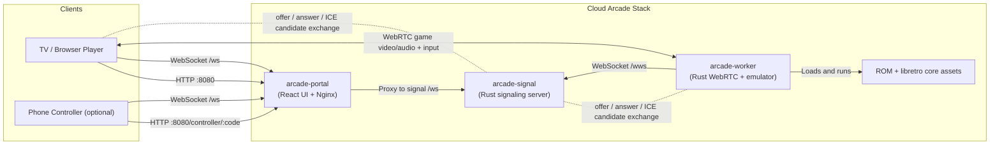

# Cloud Arcade

Web-based arcade streaming stack:
- `arcade-portal`: React UI (TV/browser)
- `arcade-signal`: Rust signaling server (WebSocket + controller pairing)
- `arcade-worker`: Rust worker (emulator + WebRTC)

## Quick Start (Docker, Recommended)

On a host with Docker + Compose v2:

```bash
cd deploy
cp .env.production.example .env.production
./container-stack.sh up --env-file .env.production
```

Lifecycle:
```bash
cd deploy
./container-stack.sh status
./container-stack.sh logs
./container-stack.sh restart
./container-stack.sh down
```

Notes:
- Avoid running `docker compose ...` and `deploy/container-stack.sh` simultaneously on the same ports.
- LAN WebRTC is typically most reliable with `WORKER_NETWORK_MODE=host` (supported by `container-stack.sh`).

## URLs

Defaults (override via `deploy/.env.production`):
- Portal: `http://<host>:8080/`
- Signaling WS: `ws://<host>:8000/ws`
- Signaling health: `http://<host>:8000/healthz`
- Portal health: `http://<host>:8080/healthz`

Internal routes:
- Browser signaling: `/ws`
- Worker signaling bridge: `/wws`

## Playing

1. Open the portal: `http://<host>:8080/`
2. Pick a room (game card) to start streaming.
3. Control options:
   - Keyboard and gamepad work on the game page.
   - Touch controls appear on touch devices.
   - Phone controller:
     - On the game page, scan the QR code (or open `/controller/<code>` on your phone).
     - The phone controller is designed for landscape orientation.
     - Each paired phone becomes a player (up to 8).
     - On the phone controller, use “Enable game audio” to resume audio playback on the TV/browser tab (audio stays on the TV, not the phone).

## Smoke Check

When the stack is running:
```bash
python3 deploy/ws-smoke-check.py --host 127.0.0.1 --port 8000
```

## Native Runner (Optional)

If you can’t use containers, the native runner starts the same stack on the host:

```bash
cd deploy
cp .env.native.example .env.native.local
./native-stack.sh up --env-file .env.native.local
```

Native lifecycle:
```bash
cd deploy
./native-stack.sh status
./native-stack.sh logs
./native-stack.sh down
```

## Architecture Diagram

